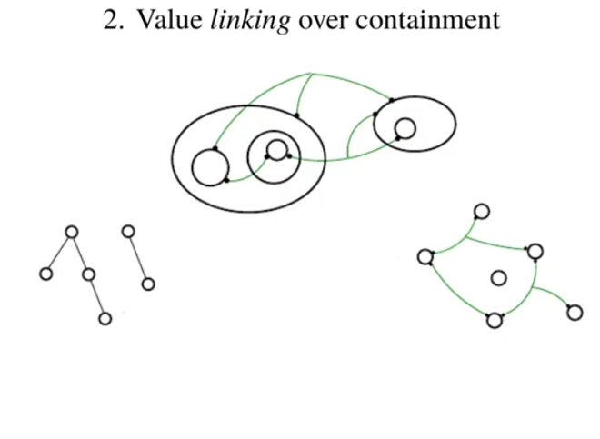

[Zero Knowledge #253](https://zeroknowledge.fm/253-2/): Anoma's "homogeneous architecture, heterogeneous security" is an interesting idea. Could be useful in decoupling apps and innovation from security and social bubbles. Feels like a flip of eigenlayer's approach, but addressing a similar core problem.

Feels criminal not to mention, Metamuse podcast--the app is cool too. At least half the links in [[rr3:Rabbithole Roundup #3]] links branched from there. Bangers on [local-first](https://museapp.com/podcast/41-local-first-software/), [BYO client](https://museapp.com/podcast/34-bring-your-own-client/), [homemade tools](https://museapp.com/podcast/42-self-made-tools/),[ playful software](https://museapp.com/podcast/27-playful-software/), [longevity](https://museapp.com/podcast/49-software-longevity/), and many other things.

### Networks vs Empires 
Notes from "Convivial design heuristics for software systems" by [Stephen Kell](https://www.humprog.org/~stephen/): applications / libraries / jobs exist _inside_ a ecosystem / language / country. To become useful requires becoming dominant. Becoming dominant leads to eventual capture of hostage users, rather than fans. 
*"The Space and Motion of Communicating Agents" by [Robin Milner](https://cl.cam.ac.uk/archive/rm135/uam-theme.html)*

### Loose threads
GLBs. What's biconomy doing? Armada. Peridot
