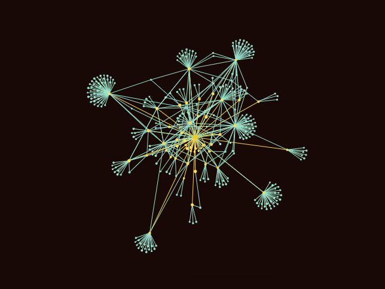

### Social Unbundling 
Imagine a restaurant that only sold rice. Open 12 hours a day. 7 days a week. Brown, White, Sticky, Fried, Jollof, blended, mashed, or boiled but always rice. How long could they realistically milk the novelty of their artificially created constraint?

This weekend was a quick dive into the "unbundler" space. Why do we do this thing anyway? Maintaining a presence across 5 different networks and platforms with near identical functionality. Often to stay in touch with people, stuck with this same affliction. Kind of like, going to 3 different restaurants to get a round meal. Unbundlers aggregate feeds across multiple networks and media forms, and present them in a way that might be more useful to the human on the other end. 

[Fraidycat](https://github.com/kickscondor/fraidycat) creates “a personal surveillance network” of people you want to monitor.  Everything is organized by recency, although you can sort follows into tags and priority. Proudly, a "tool for you to _wield_."

I found Fraidycat in the comment section of a blog post, which was linked to in an are.na channel. A channel I do not follow with very strong ties 
across the [every single are.na channel related to having a healthy and non-obsessive relationship to technology](https://www.are.na/emanuel-f/every-single-are-na-channel-related-to-having-a-healthy-and-non-obsessive-relationship-to-technology) supercluster. 
 
*visualized with [g02 graph](https://hardly.link/projects/g02-graph)* 

All quite funny because, of course, the creator of Fraidycat also has an esoteric blog with links back to are.na, quotebacks, and beaker browser. All my rabbits seem to live in the same hole. 

[Yakread](https://tfos.co/p/introducing-yakread/)'s initial introduction had me jumping with excitement. Though it has since been (re)introduced with a stronger focus on newsletters. Maybe he lost The Path, or there might be something slightly broken 

### Shared Knowledge Base
And now a very different kind of media. 

Roam Research's creator went on Metamuse and took a shot at all the clones saying no one had come close to scratching collaborative thought (paraphrased). To be fair, this is a lot harder to reach with local-first architecture. But how *does* one share a collection of ideas easily?

First and most obvious would be a book or a website, but interaction here is limited. Published content is sealed off in a way that this would hopefully break down. Git repos work surprisingly well, but might be too technical (Obsidian and Logseq's funding, publishing and sync, may "affect" incentives to make this work better). Other approaches include https://reading.supply, although quite small (and a SaaS platform) it has the most fleshed out public “networked thought” network I'm aware of. Noosphere seems interesting. Mostly in specification phase? But haven't had time to dive deeper. There might also be something brewing among Bluesky's API Touchers, too early to say. 
